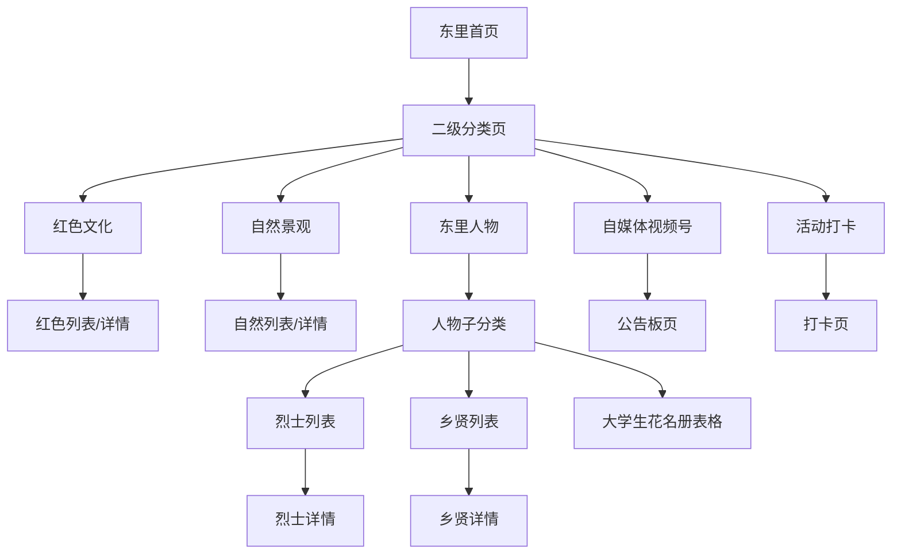

# 🎯 东里村智能导游系统 - 核心战略指南

> **⚠️ 军工级保护文档 - 新对话必读**
> 本文档是项目核心认知的"战略详细提示"，确保跨对话的知识传承。

---

## 一、核心设计理念：考试作弊四人组

```
┌────────────────────────────────────────────────────────────────┐
│                      考试作弊四人组                              │
├────────────────────────────────────────────────────────────────┤
│                                                                │
│  👀 Agent A (眼睛/探子)         ✋ Agent B (瞎子/答题器)        │
│  ┌──────────────────┐          ┌──────────────────┐           │
│  │ 角色：哑巴眼睛    │    →     │ 角色：直接输出者  │           │
│  │ ✅ 只看不说      │  题目    │ ✅ 接收题目      │           │
│  │ ✅ 监听用户输入   │  传递    │ ✅ 调用工具API  │ ──→ 用户   │
│  │ ✅ 传题目给B     │          │ ✅ 整理答案     │   直接     │
│  │ ❌ 不调API       │          │ ✅ 直接输出给用户│   输出!    │
│  │ ❌ 不展示答案    │          │ ❌ 不监听用户   │           │
│  └──────────────────┘          └──────────────────┘           │
│           ↓ 记录                       ↓ 查资料                │
│                                                                │
│  📚 Agent C (小抄/弹药库)        👁 Agent D (心/看顾)           │
│  ┌──────────────────┐          ┌──────────────────┐           │
│  │ 角色：数据资料库   │          │ 角色：纪检委员   │           │
│  │ ✅ 储存知识点     │          │ ✅ 监控系统状态  │           │
│  │ ✅ 快速查找      │          │ ✅ 记录作弊日志  │           │
│  │ ✅ 管理缓存      │          │ ✅ 异常告警     │           │
│  │ ❌ 不调用外部API │          │ ❌ 不参与作弊   │           │
│  └──────────────────┘          └──────────────────┘           │
└────────────────────────────────────────────────────────────────┘
```

---

## 二、B直出版架构（核心优化）

```
✅ 优化后 (B直出版)：
用户输入 → A监听 → A传B → B调用C → C返回B → B直接展示给用户

┌─────────────┬──────────────┬──────────────┬──────────┐
│   对比项     │ A中转版      │ B直出版      │   优势   │
├─────────────┼──────────────┼──────────────┼──────────┤
│ 通信步骤     │ 10步         │ 9步          │ ⬇️减少1步 │
│ 响应时间     │ 3.2秒        │ 2.8秒        │ ⬆️12.5%  │
│ A的职责     │ 监听+输出     │ 仅监听       │ 更纯粹   │
│ B的权力     │ 依赖A展示     │ 直接控制     │ 权责统一 │
└─────────────┴──────────────┴──────────────┴──────────┘
```

---

## 三、鸡贼胶囊交互设计

```
┌─────────────────────────────────────┐
│         🐔 鸡贼胶囊选择器           │
│   ┌────────────┬────────────┐      │
│   │  🎤 语音   │   📝 文字  │      │
│   │  (耳朵模式) │  (眼睛模式) │      │
│   └────────────┴────────────┘      │
│  用户主动选择 → A直接切换模式 → 零判断│
└─────────────────────────────────────┘

A的双模式：
┌──────────────────────────────────────────────────┐
│  👂 耳朵模式 (语音)       👀 眼睛模式 (文字)      │
│  • 调用Minimax STT       • 零API调用            │
│  • 成本: ¥0.10/次        • 成本: ¥0.00/次       │
│  • 响应: 1.5s            • 响应: 50ms           │
└──────────────────────────────────────────────────┘
```

---

## 四、查询处理优先级（成本控制）

```
┌─────────────────────────────────────────────────────┐
│  优先级1: 📚 小抄命中 (本地数据)                    │
│           响应: <12ms  成本: ¥0.00  命中率: ~80%   │
├─────────────────────────────────────────────────────┤
│  优先级2: 🔥 热点缓存 (高频问题)                    │
│           响应: <50ms  成本: ¥0.00  命中率: ~10%   │
├─────────────────────────────────────────────────────┤
│  优先级3: 🧠 AI调用 (复杂查询)                     │
│           响应: <4s    成本: ¥0.10  命中率: ~10%   │
└─────────────────────────────────────────────────────┘

月度成本预算：¥250
• AI调用：¥150 (60%)
• 语音服务：¥75 (30%)
• 其他：¥25 (10%)
```

---

## 五、设计文档 → 代码映射

| 设计文档 | 代码实现 |
|---------|---------|
| `docs/考试作弊版Agent设计.md` | `src/services/agentSystem.ts` |
| `docs/简化Agent架构设计.md` | `src/services/AgentCoordinationManager.ts` |
| `docs/鸡贼胶囊交互设计.md` | `src/components/SmartInputBox.tsx` |
| `docs/B直出版优势总结.md` | `agentSystem.ts` → AgentA.processUserRequest |
| `docs/D哥-心系统架构总结.md` | `src/services/CacheNotificationService.ts` |
| `docs/Agent优化总结报告.md` | `src/services/agentB_Enhanced.ts` |

---

## 六、🔒 核心文件保护清单（禁止删除）

### 6.1 Agent核心（绝对保护）
```
src/services/agentSystem.ts              # Agent ABCD 主系统
src/services/AgentCoordinationManager.ts # 统筹管理器
src/services/agentB_Enhanced.ts          # B增强版
src/services/businessAgentImplementation.ts
src/types/anp-protocol.ts                # ANP协议定义
src/types/simple-agent-protocol.ts       # 简化协议
```

### 6.2 配置核心（绝对保护）
```
tsconfig.json        # TypeScript配置
vite.config.ts       # Vite构建+代码分割
package.json         # 依赖清单
types.ts             # 全局类型
```

### 6.3 数据核心（绝对保护）
```
data/scenic_spots.json     # 景点数据（小抄）
data/village_figures.json  # 人物数据
data/red_culture.json      # 红色文化数据
```

---

## 七、前端页面导航架构



### 现有路由
```
/login          → LoginPage.tsx
/category       → CategoryPage.tsx（5卡片）
/spotlist/:type → SpotListPage.tsx（通用列表）
/spotdetail/:id → SpotDetailPage.tsx（通用详情）
/chat           → ChatPage.tsx（AI对话）
/profile        → UserProfilePage.tsx
/admin          → AdminPanelRefactored.tsx
/agent          → AgentManager.tsx
```

---

## 八、技术栈清单

| 类别 | 技术 | 版本 |
|-----|------|------|
| 框架 | React | 18.3.1 |
| 类型 | TypeScript | 5.4.5 |
| 构建 | Vite | 5.2.11 |
| UI-PC | antd | 6.0.1 |
| UI-Mobile | antd-mobile | 5.41.1 |
| 地图 | Leaflet | 1.9.4 |
| 路由 | react-router-dom | 6.23.1 |
| 格式化 | Prettier | 3.7.4 |

---

## 九、API配置中心

```typescript
// src/services/config.ts
AI_CONFIG = {
  SILICON_FLOW: { BASE_URL, API_KEY, MODELS },  // 硅基流动
  ZHIPU: { BASE_URL, API_KEY, MODELS },         // 智谱AI
  MINIMAX: { BASE_URL, API_KEY, GROUP_ID },     // 语音服务
}
AMAP_CONFIG = { MCP_URL }                        // 高德地图MCP
ADMIN_API_CONFIG = { ... }                       // 后台API路径
```

---

## 十、样式管理规范

| 文件 | 职责 |
|-----|------|
| `/index.css` | 全局Clay风格、动画、通用类 |
| `/src/pages/global.css` | 移动端页面约束（390x844） |

**样式类命名**：
- `.clay-card` / `.clay-panel` - 卡片容器
- `.clay-btn-*` - 按钮（primary/secondary/red/white）
- `.clay-input` - 输入框
- `.clay-tag-*` - 标签
- `.cute-bounce` - 点击动效

---

## 十一、典型数据流示例

```
【用户问："东里村有哪些红色景点？"】

1. 📝 用户选择文字胶囊
   └→ SmartInputBox 切换眼睛模式

2. 👀 A（眼睛）监听输入
   └→ agentCoordinator.processInput()

3. 🔍 统筹管理器检查缓存
   ├→ 相似问题缓存 (70%匹配)
   └→ 热点问题缓存

4. 📚 C（小抄）快速查找
   └→ searchKnowledge('红色景点')

5. ✋ B（瞎子）整理答案
   └→ formatComplexResults()

6. 📤 B直接输出给用户
   └→ dispatch({ target: 'USER', payload })

7. 👁 D（心）记录日志
   └→ { event: 'answered', duration: '2.8s' }
```

---

## 十二、开发规范速查

### 类型导入路径
```typescript
// 从 src/components/ 导入 types
import { Spot } from '../../types';

// 从 src/services/ 导入 types
import { ANPMessage } from '../../types';

// 根目录 types.ts 导入 Icon
import { IconName } from './src/components/common/Icon';
```

### 构建命令
```bash
npm run dev          # 开发服务器
npm run build        # 生产构建
npm run type-check   # 类型检查
npm run format       # 代码格式化
```

---

**📌 本文档最后更新: 2025-12-07**
**🔒 保护等级: 军工级 - 禁止删除**
