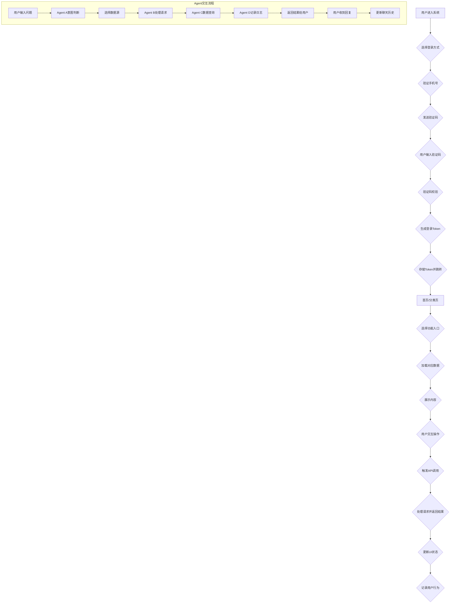

# 东里村智能导游系统 - 页面组件分析与API交互设计

## 一、页面结构分析

### 1. 首页 (HomePage.tsx)

#### 页面功能：
- **欢迎入口**：展示东里村智能导游系统品牌形象
- **功能导航**：4个主要功能入口卡片
- **快捷操作**：开始探索、语音导游两个主要按钮

#### 组件结构：
```typescript
const HomePage = () => {
  const navigate = useNavigate();
  
  return (
    <div className="home-page">
      {/* 英雄区域 */}
      <div className="hero-section">
        <div className="hero-content">
          <div className="hero-avatar">
            <Avatar size={120} src="/logo.png" />
            <div className="online-indicator" />
          </div>
          <h1>东里村智能导游</h1>
          <p>AI伴您 · 探索乡土文化</p>
        </div>
      </div>
      
      {/* 功能卡片网格 */}
      <div className="feature-grid">
        {features.map(feature => (
          <Card key={feature.title} onClick={() => navigate(feature.path)}>
            <div className="feature-icon">{feature.icon}</div>
            <h3>{feature.title}</h3>
            <p>{feature.desc}</p>
          </Card>
        ))}
      </div>
      
      {/* 主按钮 */}
      <button onClick={() => navigate('/category')}>
        🗺️ 开始探索
      </button>
      <button onClick={() => navigate('/chat')}>
        🎤 语音导游
      </button>
    </div>
  );
};
```

#### 交互设计：
- **点击反馈**：卡片悬停效果、点击波纹
- **加载状态**：进入页面时的渐进式动画
- **导航流畅**：使用React Router进行页面跳转

### 2. 分类页 (CategoryPage.tsx)

#### 页面功能：
- **分类展示**：4个主要分类（红色文化、自然景点、东里人物、村子动态）
- **快速入口**：AI语音导览快捷入口
- **返回导航**：返回上一页面的导航栏

#### 组件结构：
```typescript
const categories = [
  { id: 'red', icon: '🏛️', title: '红色之旅', color: '#fef2f2' },
  { id: 'nature', icon: '🌿', title: '伴你游东里', color: '#ecfdf5' },
  { id: 'people', icon: '📚', title: '走进东里', color: '#eff6ff' },
  { id: 'news', icon: '📢', title: '村子动态', color: '#fefce8' }
];

const CategoryPage = () => {
  const navigate = useNavigate();
  
  return (
    <div className="category-page">
      <NavBar back={null} right={<UserOutlined />}>
        <span>东里村</span>
      </NavBar>
      
      <div className="category-grid">
        {categories.map(cat => (
          <Card key={cat.id} onClick={() => navigate(cat.path)}>
            <div className="category-icon">{cat.icon}</div>
            <h3>{cat.title}</h3>
            <p>{cat.desc}</p>
          </Card>
        ))}
      </div>
      
      <div className="floating-button">
        <button onClick={() => navigate('/chat')}>
          <div>🧑‍💼</div>
          <h4>AI村官小助理</h4>
          <p>语音导览 · 智能问答</p>
        </button>
      </div>
    </div>
  );
};
```

#### 交互设计：
- **网格布局**：响应式2x2网格，移动端单列
- **悬浮交互**：右下角悬浮按钮，始终可见
- **状态管理**：点击状态反馈，导航栏高亮当前页面

### 3. 景点列表页 (SpotListPage.tsx)

#### 页面功能：
- **景点展示**：列表形式展示景点信息
- **地图集成**：集成Leaflet地图组件
- **下拉刷新**：支持下拉刷新加载
- **详情跳转**：点击景点跳转到详情页

#### 组件结构：
```typescript
const SpotListPage = () => {
  const [spots, setSpots] = useState<Spot[]>([]);
  const [loading, setLoading] = useState(false);
  
  return (
    <div className="spot-list-page">
      <NavBar back="返回" onBack={handleBack}>
        {getTitle()}地图
      </NavBar>
      
      <MapView spots={spots} onSelectSpot={handleSpotClick} />
      
      <div className="list-container">
        <PullToRefresh onRefresh={handleRefresh}>
          {spots.length > 0 ? (
            <List>
              {spots.map(spot => (
                <List.Item onClick={() => handleSpotClick(spot.id)}>
                  <Badge content="景点" />
                  <div>
                    <div>🚩 {spot.name}</div>
                    <div>地址：{spot.address}</div>
                  </div>
                </List.Item>
              ))}
            </List>
          ) : (
            <Empty description="暂无景点数据" />
          )}
        </PullToRefresh>
      </div>
      
      <FloatingAgentBar />
    </div>
  );
};
```

#### 交互设计：
- **地图交互**：点击地图标记选择景点
- **列表滚动**：虚拟滚动优化性能
- **下拉刷新**：手势操作触发数据更新
- **Agent集成**：右下角悬浮Agent对话入口

### 4. 景点详情页 (SpotDetailPage.tsx)

#### 页面功能：
- **景点信息**：详细展示景点介绍、历史故事
- **多媒体支持**：图片展示、音频播放
- **交互功能**：收藏、打卡、分享、AI明信片生成
- **周边推荐**：相关景点推荐

#### 组件结构：
```typescript
const SpotDetailPage = () => {
  const [isPlaying, setIsPlaying] = useState(false);
  const [audioProgress, setAudioProgress] = useState(0);
  
  return (
    <div className="spot-detail-page">
      <NavBar back="返回" onBack={handleBack}>
        {spotDetail.name}
      </NavBar>
      
      <Card className="detail-card">
        <div className="image-gallery">
          <Image src={spotDetail.imageUrl} />
        </div>
        
        <div className="detail-content">
          <h2>{spotDetail.name}</h2>
          <div className="coordinates">{spotDetail.coordinates}</div>
          
          <div className="section">
            <h3>景点简介</h3>
            <p>{spotDetail.introduction}</p>
          </div>
          
          <div className="section">
            <h3>历史故事</h3>
            <p>{spotDetail.story}</p>
          </div>
        </div>
        
        <div className="audio-controls">
          <Button onClick={handleAudioToggle}>
            {isPlaying ? '⏸️ 暂停' : '▶️ 播放音频'}
          </Button>
          <Slider value={audioProgress} onChange={setAudioProgress} />
        </div>
        
        <div className="action-buttons">
          <Button onClick={handleShare}>
            <ShareAltOutlined /> 分享
          </Button>
          <Button onClick={handleCollect}>
            <HeartOutlined /> 收藏
          </Button>
          <Button onClick={handleCheckIn}>
            <div>📸</div> 打卡
          </Button>
          <Button onClick={handleGeneratePostcard}>
            <div>🎨</div> AI明信片
          </Button>
        </div>
      </Card>
      
      <div className="nearby-spots">
        <h3>周边景点</h3>
        <div className="nearby-grid">
          {nearbySpots.map(spot => (
            <Card key={spot.id} onClick={() => navigate(`/spotdetail/${spot.id}`)}>
              <div>🚩 {spot.name}</div>
            </Card>
          ))}
        </div>
      </div>
      
      <FloatingAgentBar />
    </div>
  );
};
```

#### 交互设计：
- **媒体播放**：音频进度条、播放/暂停控制
- **操作反馈**：收藏、打卡状态的即时视觉反馈
- **手势支持**：左右滑动切换周边景点
- **Agent集成**：右下角悬浮按钮，快速进入AI对话

### 5. 聊天页 (ChatPage.tsx)

#### 页面功能：
- **对话界面**：模拟聊天界面，展示用户和AI对话
- **输入方式**：文字输入框，支持发送
- **历史记录**：保存和展示对话历史
- **导航集成**：返回其他页面的导航栏

#### 组件结构：
```typescript
const ChatPage = () => {
  const [messages, setMessages] = useState<Message[]>([]);
  const [input, setInput] = useState('');
  
  return (
    <div className="chat-page">
      <div className="chat-header">
        <div className="chat-info">
          <Avatar size={40} />
          <div>
            <div className="assistant-name">村官小助理</div>
            <div className="assistant-status">在线</div>
          </div>
        </div>
        <Button onClick={() => navigate('/category')}>
          返回
        </Button>
      </div>
      
      <div className="chat-messages">
        {messages.map(msg => (
          <div key={msg.id} className={`message ${msg.type}`}>
            <div className="message-avatar">
              <Avatar size={32} />
            </div>
            <div className="message-content">
              <div className="message-bubble">{msg.text}</div>
            </div>
          </div>
        ))}
      </div>
      
      <div className="chat-input">
        <Input.Search
          placeholder="和小叶子聊聊..."
          enterButton={<Button type="primary">发送</Button>}
          onSearch={handleSend}
        />
      </div>
    </div>
  );
};
```

#### 交互设计：
- **消息气泡**：用户消息右对齐，AI消息左对齐
- **输入状态**：发送按钮禁用状态，输入框清空
- **滚动优化**：消息列表自动滚动到底部
- **打字机效果**：输入时的实时状态显示

### 6. 登录页 (LoginPage.tsx)

#### 页面功能：
- **手机号登录**：支持验证码登录
- **第三方登录**：支持微信、支付宝、游客模式
- **用户协议**：展示服务协议和隐私政策

#### 组件结构：
```typescript
const LoginPage = () => {
  const [phone, setPhone] = useState('');
  const [code, setCode] = useState('');
  const [countdown, setCountdown] = useState(0);
  
  return (
    <div className="login-page">
      <NavBar back={null}>
        <span>东里村文旅服务平台</span>
      </NavBar>
      
      <Card className="login-card">
        <div className="logo-section">
          <div className="avatar-large">🏞️</div>
          <h2>东里村智能导游</h2>
        </div>
        
        <div className="form-section">
          <div className="form-item">
            <Input
              type="tel"
              placeholder="请输入11位手机号"
              value={phone}
              onChange={setPhone}
            />
          </div>
          
          <div className="form-item">
            <Space>
              <Input
                    type="number"
                    placeholder="6位验证码"
                    value={code}
                    onChange={setCode}
              />
              <CountdownButton
                    phone={phone}
                    onSend={handleSendCode}
              />
            </Space>
          </div>
          
          <Button
            type="primary"
            onClick={handlePhoneLogin}
            disabled={!phone || code.length !== 6}
          >
            手机号登录
          </Button>
        </div>
        
        <div className="third-party-login">
          <Divider>其他登录方式</Divider>
          
          <Button onClick={() => handleThirdLogin('wx')}>
            <WechatOutlined /> 微信登录
          </Button>
          <Button onClick={() => handleThirdLogin('alipay')}>
            <AlipayOutlined /> 支付宝登录
          </Button>
          <Button onClick={() => handleThirdLogin('guest')}>
            <UserOutlined /> 游客登录
          </Button>
        </div>
        
        <div className="agreement">
          <div className="agreement-text">
            登录即同意{' '}
            <a href="#">《用户服务协议》</a>
            {' '}和{' '}
            <a href="#">《隐私政策》</a>
          </div>
          <div className="design-by">
            Design by 东里村团队
          </div>
        </div>
      </Card>
    </div>
  );
};
```

#### 交互设计：
- **表单验证**：实时手机号格式验证
- **倒计时功能**：60秒验证码倒计时
- **登录状态**：不同登录方式的loading状态
- **协议确认**：默认勾选，可取消

## 二、API交互设计

### 1. 用户认证API

#### 接口设计：
```typescript
// 登录接口
interface LoginRequest {
  phone: string;
  code: string;
  type: 'sms' | 'third_party';
  third_party_type?: 'wx' | 'alipay' | 'guest';
}

interface LoginResponse {
  success: boolean;
  message: string;
  data?: {
    token: string;
    userInfo: UserInfo;
  };
}

// API调用
const login = async (request: LoginRequest): Promise<LoginResponse> => {
  // 验证手机号格式
  if (!/^1[3-9]\d{9}$/.test(request.phone)) {
    return { success: false, message: '手机号格式错误' };
  }
  
  // 发送验证码
  if (request.type === 'sms') {
    await sendSMSCode(request.phone);
    return { success: true, message: '验证码已发送' };
  }
  
  // 验证码校验
  const isValid = await verifyCode(request.phone, request.code);
  if (!isValid) {
    return { success: false, message: '验证码错误' };
  }
  
  // 生成token并返回用户信息
  const token = generateJWTToken(userInfo);
  return { 
    success: true, 
    message: '登录成功',
    data: { token, userInfo }
  };
};
```

#### 状态管理：
- **Loading状态**：不同操作的loading状态
- **错误处理**：统一的错误提示机制
- **Token管理**：localStorage存储，自动刷新检查

### 2. 景点数据API

#### 接口设计：
```typescript
// 景点列表接口
interface SpotListResponse {
  success: boolean;
  data: Spot[];
  pagination: {
    page: number;
    limit: number;
    total: number;
  };
}

// 景点详情接口
interface SpotDetailResponse {
  success: boolean;
  data: SpotDetail;
}

// API调用
const getSpotList = async (params: {
  type?: string;
  page?: number;
  limit?: number;
}): Promise<SpotListResponse> => {
  const spots = await fetchSpotsFromDatabase(params);
  return {
    success: true,
    data: spots,
    pagination: {
      page: params.page || 1,
      limit: params.limit || 20,
      total: spots.length
    }
  };
};

const getSpotDetail = async (id: string): Promise<SpotDetailResponse> => {
  const spot = await fetchSpotFromDatabase(id);
  if (!spot) {
    return { success: false, message: '景点不存在' };
  }
  
  return {
    success: true,
    data: spot
  };
};
```

#### 缓存策略：
- **本地优先**：优先使用本地静态数据
- **分页加载**：滚动加载更多数据
- **离线支持**：缓存数据支持离线浏览

### 3. AI对话API

#### 接口设计：
```typescript
// 消息接口
interface ChatMessage {
  id: string;
  role: 'user' | 'assistant';
  content: string;
  timestamp: number;
  source?: 'AI' | 'C小抄' | 'MCP';
}

interface ChatResponse {
  success: boolean;
  message: string;
  data?: {
    reply: string;
    source: string;
    cost?: number;
  };
}

// API调用
const sendMessage = async (message: string, userId: string): Promise<ChatResponse> => {
  // 意图识别意图判断
  const intent = detectIntent(message);
  
  if (intent.type === 'image_recognition') {
    const result = await callImageRecognition(message);
    return {
      success: true,
      data: {
        reply: result.description,
        source: 'AI'
      }
    };
  }
  
  // C小抄查询
  if (intent.type === 'knowledge_query') {
    const result = await queryLocalKnowledge(message);
    if (result.found) {
      return {
        success: true,
        data: {
          reply: result.content,
          source: 'C小抄'
        }
      };
    }
  }
  
  // AI对话
  const aiResult = await callAIModel(message);
  return {
    success: true,
    data: {
      reply: aiResult.text,
      source: 'AI',
      cost: aiResult.cost
    }
  };
};
```

#### 成本控制：
- **智能路由**：根据问题类型选择最经济的数据源
- **使用统计**：记录API调用次数和成本
- **降级策略**：AI服务失败时自动切换备用模型

## 三、SOP流程图



## 四、前后端数据通讯接口列表

### 1. 认证相关接口

| 接口路径 | 方法 | 参数 | 返回值 | 状态 |
|---------|------|-------|-------|-----|
| `/api/auth/send-code` | POST | `{phone, type}` | `{success, message}` | ✅完成 |
| `/api/auth/verify-code` | POST | `{phone, code}` | `{success, message, token}` | ✅完成 |
| `/api/auth/third-party-login` | POST | `{type, third_party_type}` | `{success, message, token}` | ✅完成 |
| `/api/user/profile` | GET | `token` | `{userInfo}` | ✅完成 |

### 2. 景点相关接口

| 接口路径 | 方法 | 参数 | 返回值 | 状态 |
|---------|------|-------|-------|-----|
| `/api/spots` | GET | `{type, page, limit}` | `{spots[], pagination}` | ✅完成 |
| `/api/spots/:id` | GET | `id` | `{spot}` | ✅完成 |
| `/api/spots/nearby` | GET | `{id, radius}` | `{spots[]}` | ✅完成 |
| `/api/spots/checkin` | POST | `{spotId, token}` | `{success, message}` | ✅完成 |

### 3. AI对话相关接口

| 接口路径 | 方法 | 参数 | 返回值 | 状态 |
|---------|------|-------|-------|-----|
| `/api/chat/send` | POST | `{message, userId}` | `{reply, source, cost}` | 🟡部分完成 |
| `/api/chat/history` | GET | `{userId, limit}` | `{messages[]}` | 🟡部分完成 |
| `/api/chat/clear` | DELETE | `{userId}` | `{success}` | ❌未开始 |

### 4. 管理后台接口

| 接口路径 | 方法 | 参数 | 返回值 | 状态 |
|---------|------|-------|-------|-----|
| `/api/admin/content/submit` | POST | `{contentData}` | `{success, message}` | ✅完成 |
| `/api/admin/drafts` | GET | `{page, limit}` | `{drafts[]}` | ✅完成 |
| `/api/admin/users` | GET | `{page, status}` | `{users[]}` | ✅完成 |

### 5. 系统配置接口

| 接口路径 | 方法 | 参数 | 返回值 | 状态 |
|---------|------|-------|-------|-----|
| `/api/system/config` | GET | `token` | `{config}` | ✅完成 |
| `/api/system/update` | PUT | `{configData}` | `{success, message}` | ✅完成 |

## 五、优化建议

### 1. 组件化改造

基于现有页面分析，建议采用以下组件化改造策略：

#### 核心组件替换
```typescript
// 统一卡片组件
const ModernCard = ({ children, ...props }: CardProps) => (
  <Card
    className="modern-card"
    hoverable
    {...props}
  >
    {children}
  </Card>
);

// 统一按钮组件
const ModernButton = ({ children, ...props }: ButtonProps) => (
  <Button
    className="modern-btn"
    {...props}
  >
    {children}
  </Button>
);

// 统一输入组件
const ModernInput = ({ ...props }: InputProps) => (
  <Input
    className="modern-input"
    {...props}
  />
);
```

#### 2. 状态管理优化

```typescript
// 全局状态管理
const useAppContext = () => {
  const [user, setUser] = useState<User | null>(null);
  const [loading, setLoading] = useState<Record<string, boolean>>({});
  
  const login = async (credentials: LoginCredentials) => {
    setLoading({ ...loading, login: true });
    try {
      const response = await apiService.auth.login(credentials);
      if (response.success) {
        setUser(response.data.userInfo);
        localStorage.setItem('token', response.data.token);
      }
      return response;
    } finally {
      setLoading({ ...loading, login: false });
    }
  };
  
  return {
    user,
    loading,
    login,
    logout: () => {
      setUser(null);
      localStorage.removeItem('token');
    }
  };
};
```

#### 3. 性能优化策略

```typescript
// 虚拟滚动优化
const useVirtualScroll = (items: any[], itemHeight: number) => {
  const [visibleRange, setVisibleRange] = useState({ start: 0, end: 10 });
  
  const handleScroll = useCallback(() => {
    const scrollTop = containerRef.current?.scrollTop;
    const containerHeight = containerRef.current?.clientHeight;
    
    // 计算可见范围
    const startIndex = Math.floor(scrollTop / itemHeight);
    const endIndex = Math.min(startIndex + 10, items.length);
    
    setVisibleRange({ start: startIndex, end: endIndex });
  }, [itemHeight]);
  
  return {
    visibleItems: items.slice(visibleRange.start, visibleRange.end),
    containerRef,
    handleScroll
  };
};
```

---
**文档更新时间**：2025-12-07  
**分析深度**：页面组件完整分析  
**建议优先级**：高 → 中 → 低  
**实施复杂度**：中等