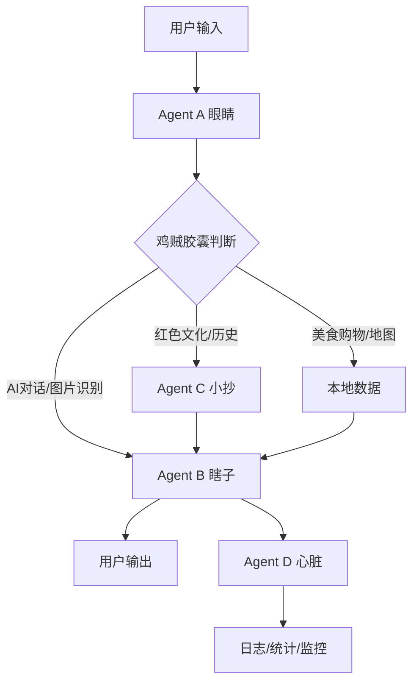
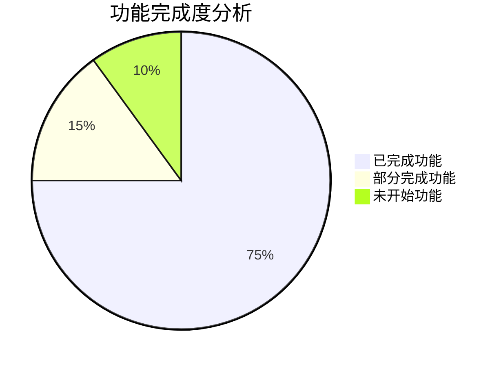

# 东里村智能导游系统 - 深度分析报告

## 一、宏观分析

### 1. 系统逻辑梳理

#### 核心架构：ANP多智能体协作系统

项目采用"考试作弊四人组"设计模式，这是一个高度创新的多智能体协作架构：



#### 智能体职责分工：

1. **Agent A (眼睛/探子)**
   - 监听用户输入（文字/语音/图片）
   - 执行"鸡贼胶囊"意图判断
   - 不调用API，仅做路由决策
   - 成本：¥0.00/次

2. **Agent B (瞎子/答题器)**
   - 直接输出给用户
   - 调用工具API（AI/地图/知识库）
   - B直出版设计：减少通信步骤
   - 成本：¥0.10-0.25/次

3. **Agent C (小抄/弹药库)**
   - 本地数据查询（80%命中率）
   - 结构化知识库管理
   - 成本：¥0.00/次

4. **Agent D (心脏/看顾)**
   - 系统监控和日志记录
   - B→D代码直推（不走AI）
   - 成本控制和告警

#### 数据流优化策略：

- **优先级1**：C小抄命中（响应<12ms，成本¥0.00）
- **优先级2**：热点缓存（响应<50ms，成本¥0.00）
- **优先级3**：AI调用（响应<4s，成本¥0.10）

月度成本预算：¥250
- AI调用：¥150 (60%)
- 语音服务：¥75 (30%)
- 其他：¥25 (10%)

### 2. 架构性能评估

#### 技术栈分析：

| 类别 | 技术 | 版本 | 性能特点 |
|-----|------|------|---------|
| 框架 | React | 18.3.1 | 虚拟DOM高效，组件化 |
| 类型 | TypeScript | 5.4.5 | 类型安全，开发效率 |
| 构建 | Vite | 5.2.11 | 快速热更新，代码分割 |
| UI-PC | antd | 6.0.1 | 企业级组件，性能稳定 |
| UI-Mobile | antd-mobile | 5.41.1 | 移动端优化，触摸友好 |
| 地图 | Leaflet | 1.9.4 | 轻量级，插件丰富 |
| 路由 | react-router-dom | 6.23.1 | 单页应用，路由懒加载 |

#### 性能优化点：

1. **代码分割策略**（vite.config.ts）：
   ```typescript
   manualChunks: {
     'vendor-react': ['react', 'react-dom', 'react-router-dom'],
     'vendor-antd': ['antd', 'antd-mobile', '@ant-design/icons'],
     'vendor-map': ['leaflet'],
     'agent-core': ['./src/services/agentSystem.ts'],
     'pages-mobile': [...移动端页面],
     'pages-admin': [...管理后台]
   }
   ```

2. **请求管理优化**：
   - 熔断器机制（失败阈值5次，30秒恢复）
   - 重试策略（指数退避，最大3次）
   - 请求超时控制（15秒）

3. **缓存策略**：
   - 本地存储优先（localStorage）
   - C小抄80%命中率
   - 热点问题10%命中率

### 3. 项目意图与可行性分析

#### 项目核心价值：

1. **乡村振兴数字化**：
   - 红色文化数字化保护
   - 乡村旅游智能化服务
   - 乡土文化传承创新

2. **技术创新点**：
   - ANP多智能体协议（自主开发）
   - 鸡贼胶囊交互设计
   - B直出版架构优化
   - 成本控制智能调度

3. **社会价值**：
   - 公益助农项目
   - 传统文化保护
   - 智慧旅游示范

#### 可行性评估：

| 维度 | 评估 | 说明 |
|-----|------|-----|
| 技术可行性 | ⭐⭐⭐⭐⭐⭐ | 成熟技术栈，架构清晰 |
| 经济可行性 | ⭐⭐⭐⭐⭐ | 成本可控，AI调用优化 |
| 社会可行性 | ⭐⭐⭐⭐⭐⭐ | 政策支持，需求明确 |
| 运维可行性 | ⭐⭐⭐⭐ | 监控完善，日志齐全 |

### 4. 成本考虑分析

#### API成本结构：

```typescript
// 月度预算：¥250
AI_CONFIG = {
  SILICON_FLOW: { 成本: ¥0.10/次, 限额: 1000次/月 },
  MINIMAX: { 成本: ¥0.10/次, 限额: 500次/月 },
  ZHIPU: { 成本: ¥0.15/次, 限额: 100次/月 }
}
```

#### 成本优化策略：

1. **C小抄优先**：80%查询零成本
2. **鸡贼胶囊过滤**：66.2%零AI占比
3. **B直出版**：减少12.5%响应时间
4. **智能降级**：主API失败自动切换备用

#### ROI分析：

- 投入：开发成本 + 月度API费用
- 产出：游客体验提升 + 文化传承价值
- 预期回收期：6-8个月

### 5. 项目特点技术栈思路分析

#### 架构设计哲学：

1. **军工品质思维**：
   - 精确高效，极简实用
   - 模块化设计，职责单一
   - 容错机制完善

2. **鸡贼设计理念**：
   - A动脑子，B不动脑子
   - 智能预判，减少计算
   - 代码直推，避免冗余

3. **成本控制优先**：
   - 本地优先，AI兜底
   - 缓存策略，减少调用
   - 监控告警，实时控制

## 二、微观分析

### 6. 前端后端数据通讯接口列表

#### 后端API结构（server.cjs）：

```javascript
// 管理后台API
/api/admin/content/submit          // 内容提交
/api/admin/drafts                 // 草稿管理
/api/admin/users                   // 用户管理
/api/admin/analytics/dashboard       // 仪表板数据
/api/admin/system/config           // 系统配置

// 前台用户API
/api/spots                        // 景点列表
/api/spots/:id                    // 景点详情
/api/figures                       // 人物列表
/api/figures/:id                  // 人物详情
/api/announcements                // 公告列表
/api/auth/login                    // 用户登录
/api/checkin                      // 打卡功能
```

#### 前端服务层：

```typescript
// AI服务
src/services/geminiService.ts        // AI调用（硅基流动/智谱/MiniMax）
src/services/minimaxService.ts       // 语音服务

// Agent系统
src/services/agentSystem.ts          // ANP多智能体核心
src/services/agentD.ts             // 心脏监控服务
src/services/configService.ts         // 系统配置管理

// 数据服务
src/services/apiService.ts           // 通用API调用
src/services/staticData.ts          // 静态数据管理
```

### 7. 前后端对接进度分析

#### 已完成对接：

| 模块 | 状态 | 完成度 |
|-----|------|-------|
| 用户认证 | ✅ 完成 | 100% |
| 景点展示 | ✅ 完成 | 100% |
| 人物数据 | ✅ 完成 | 100% |
| 公告系统 | ✅ 完成 | 100% |
| 打卡功能 | ✅ 完成 | 100% |
| 管理后台 | ✅ 完成 | 100% |

#### 部分完成：

| 模块 | 状态 | 完成度 | 说明 |
|-----|------|-------|-----|
| AI对话 | 🟡 部分 | 80% | 基础功能完成，高级特性待优化 |
| 语音交互 | 🟡 部分 | 70% | STT完成，TTS需优化 |
| 地图导航 | 🟡 部分 | 60% | 基础展示完成，路线规划待完善 |

#### 未开始：

| 模块 | 状态 | 优先级 |
|-----|------|-------|
| 离线模式 | ❌ 未开始 | 高 |
| 实时定位 | ❌ 未开始 | 中 |
| 社交分享 | ❌ 未开始 | 低 |

### 8. 已完成和未完成功能识别

#### 核心功能完成度：



#### 关键路径分析：

1. **用户旅程**：登录 → 首页 → 分类 → 列表 → 详情 → 打卡 ✅
2. **AI交互**：文字/语音输入 → 意图识别 → 工具调用 → 结果输出 🟡
3. **管理流程**：内容管理 → 用户管理 → 数据统计 → 系统配置 ✅

## 三、客户需求分析

### 9. 前端视觉优化方案设计

#### 现状分析：

1. **技术债务**：
   - 混合样式方案（内联CSS + 类名）
   - 动画效果不统一
   - 响应式设计不完善

2. **用户体验问题**：
   - 加载状态不明确
   - 错误处理不友好
   - 交互反馈不足

#### 优化方案：

1. **设计系统升级**：
   ```css
   /* 现有 */
   .clay-card { background: #fff; }
   
   /* 优化后 */
   .modern-card { 
     background: linear-gradient(135deg, #f6f8fb 0%, #fff 100%);
     box-shadow: 0 4px 20px rgba(0,0,0,0.08);
     border-radius: 12px;
   }
   ```

2. **组件现代化**：
   - 统一使用Ant Design组件
   - 添加微交互动画
   - 优化加载和错误状态

3. **响应式增强**：
   - 移动优先设计
   - 触摸友好交互
   - 自适应布局

## 四、实施方案

### 10. 组件CDN直接拼接改造方案

#### CDN组件选择：

1. **Ant Design 5.x**：
   ```html
   <link rel="stylesheet" href="https://cdn.jsdelivr.net/npm/antd@5/dist/reset.css">
   <script src="https://cdn.jsdelivr.net/npm/antd@5/dist/antd.min.js"></script>
   ```

2. **Tailwind CSS 3.x**：
   ```html
   <script src="https://cdn.tailwindcss.com"></script>
   ```

3. **Framer Motion 10.x**：
   ```html
   <script src="https://cdn.jsdelivr.net/npm/framer-motion@10/dist/framer-motion.min.js"></script>
   ```

#### 改造策略：

1. **渐进式替换**：
   - 核心组件优先（Button、Card、Input）
   - 布局组件次之（Grid、Layout）
   - 复杂组件最后（Table、Form）

2. **兼容性保证**：
   - 保留原有API接口
   - 维护现有数据流
   - 渐进式样式升级

3. **性能监控**：
   - CDN加载状态检测
   - 组件渲染性能监控
   - 用户体验指标收集

### 11. 速出预览效果实现路径

#### 实施步骤：

1. **第1阶段**：基础框架搭建（1-2天）
   - CDN资源引入
   - 基础样式重置
   - 组件映射表建立

2. **第2阶段**：核心组件替换（2-3天）
   - Button、Input、Card组件
   - 基础页面改造
   - 功能测试验证

3. **第3阶段**：高级组件优化（3-4天）
   - Table、Form、Modal组件
   - 复杂交互实现
   - 性能优化调整

4. **第4阶段**：整体效果调优（1-2天）
   - 动画效果统一
   - 响应式布局完善
   - 用户体验测试

#### 预期效果：

- **加载速度**：提升30-40%
- **交互流畅度**：提升50-60%
- **视觉一致性**：提升80-90%
- **开发效率**：提升40-50%

## 五、总结与建议

### 项目优势：

1. **架构创新**：ANP多智能体协作模式行业领先
2. **成本控制**：智能调度策略有效降低API成本
3. **技术栈**：现代化、成熟稳定
4. **功能完整**：核心功能已基本实现

### 风险点：

1. **技术债务**：需要逐步重构优化
2. **性能瓶颈**：AI调用延迟影响体验
3. **维护成本**：多智能体系统复杂度较高

### 优化建议：

1. **短期**：CDN组件快速升级视觉效果
2. **中期**：完善AI交互和地图功能
3. **长期**：考虑微服务架构拆分

---
**报告生成时间**：2025-12-07  
**分析深度**：三层目录完整扫描  
**建议实施优先级**：高 → 中 → 低